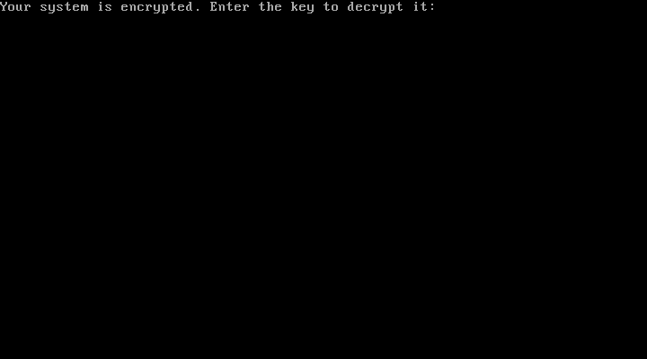
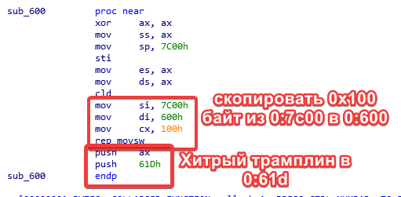
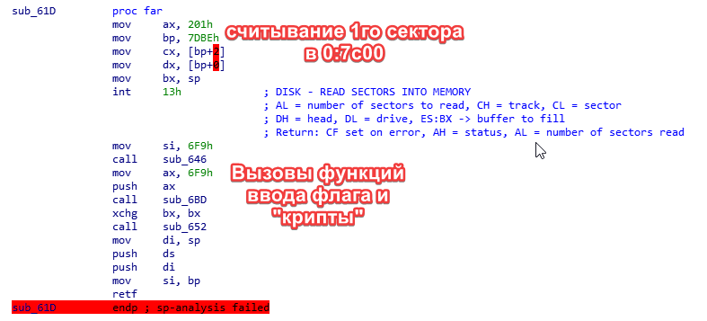
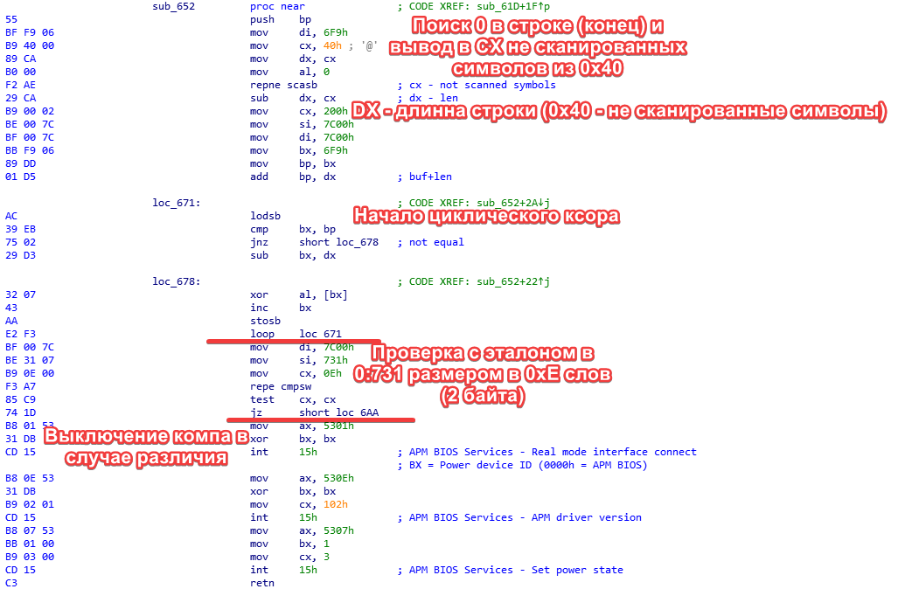
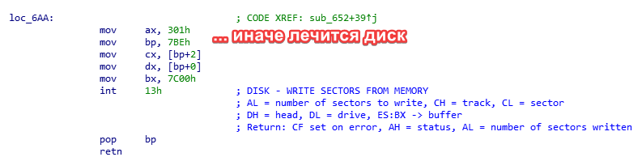
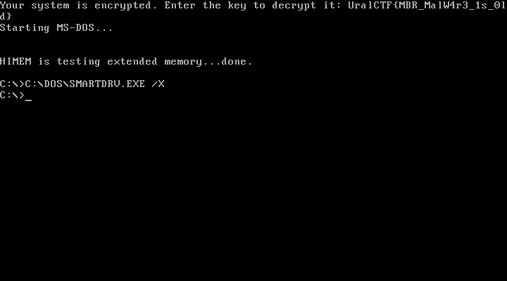

# DOS-1

**Компьютер не включается:**
Есть ли у тебя ключ?

## Райтап

Тип решения:

* [Оптимальный](#оптимальный)
* [Неоптимальный (как решал я на сореве)](#с-сорев)

### Оптимальный

Начнём с оптимальщины.

Ипортируем OVA образ в предпочитаемую программу (у меня это VirtualBox).

Запускаем и видим приветствие, просящее флаг.

На ум сразу же приходит изменённая MBR запись.

Получение MBR отличается в зависимости от типа диска, но универсальный вариант - поиск по строке приветствия.

Идём чуть выше (ориентируемся по выравниванию (последние байты адресса должны быть нулями)) и сохраняем всё в файл.

Открываем в любом 16 битном дизассемблере (я взял IDA).

После недолго взгляда можно понять, что программа делает ребейз в `600` и считывает первый сектор диска в `7c00`.

После ещё нескольких минут анализа можно увидеть, что программа делает циклический `XOR` с введённым паролем и сверяет с эталоном, расположенным по `731` размером в `0E` слов (2 байта).

Пишем [простой скрипт](./optimal.ASM) для `XOR` и получаем ответ!

**Флаг:** `UralCTF{MBR_MalW4r3_1s_0ld}`

### С сорев

Тупим около 20 минут пытаясь завести отладчик в виртуалбокс.

Находим эталон, но ошибаемся в логике.

В итоге вручную восстанавливаем сектор и делаем ксор с факапнутым.

Находим куски флага.

Понимаем что совершили пару ошибок.

Фиксим.

Сдаём флаг спустя около часа после начала, из-за собственной тупости.

**Флаг:** `UralCTF{MBR_MalW4r3_1s_0ld}`
