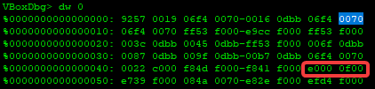
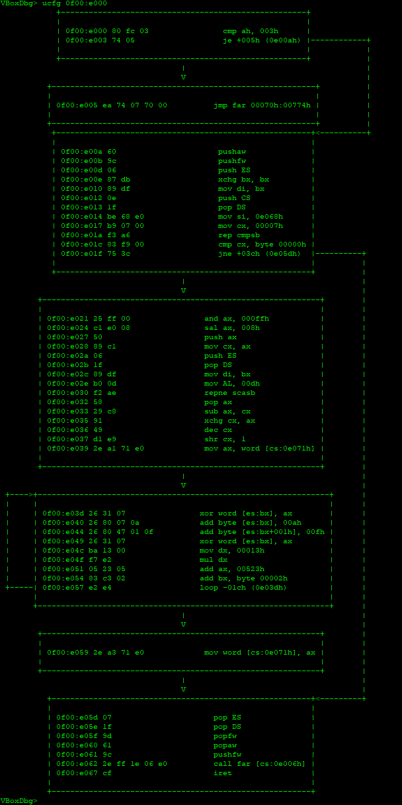

# DOS-2

**Оно само:**
Что-то пошло не так. В файл записывается совершенно не та информация.

## Райтап

Тип решения:

* [Дорешка дома](#дорешка)

### Дорешка

На самом деле в описании был жёсткий хинт, но из-за растерянности и небольшой головной боли от дос-1 (я фиксил сектор вручную) не понимаем его на соревах.

Смотрим как строится вектор прерываний.

Ищем `13h` прерывание в памяти. (формат `IP:CS`)

Делаем `ucfg CS:IP` в отладчике виртуалбокса.

После недлительного анализа понимаем что идёт ксор с меняющимся ключом.

Пишем [простой скрипт](./why.ASM) для декрипта с дефолтным ключом.

И... оно сработало. Я думал, что надо будет перебирать значения ключей для декрипта.

**Флаг:** `UralCTF{Bootkit_is_aw3s0me}`

P.S. также хинтом была дата изменения у `msdos.sys`, но я решил не делать дифф.
